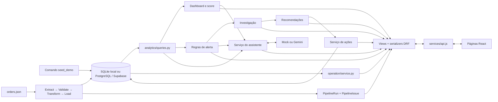

# Arquitetura do OpsMind

OpsMind é uma demo de inteligência operacional para a empresa fictícia Vértice
Operações. A base percorre fonte demonstrativa → pipeline de pedidos → operação e
indicadores → alerta → investigação → recomendação → ação. A área Operação permite
abrir atrasos, filiais e pedidos sem atribuir causalidade. Medição de resultado,
outras fontes e histórico de alertas ainda são futuros.

## Como as partes conversam

As setas representam fluxo lógico, não jobs em segundo plano. Analytics e alertas
são calculados durante as requisições. O Gemini recebe contextos selecionados pelo
backend e produz texto; não consulta o banco nem decide ações.

## Mapa para leitura

| Área | Entrada e responsabilidade |
| --- | --- |
| `frontend/src/main.jsx` | Bootstrap, tema, StrictMode e BrowserRouter |
| `frontend/src/App.jsx` | Onze rotas de página dentro do layout compartilhado |
| `frontend/src/pages/` | Requisições, estado local e composição das telas |
| `frontend/src/hooks/useDashboardData.js` | Leituras independentes da Home, cancelamento e atualização |
| `frontend/src/hooks/useApiResource.js` | Estado reutilizável de leitura, retry e cancelamento da área Operação |
| `frontend/src/utils/dashboard.js` | Adaptação de unidades e evidências existentes, sem recalcular indicadores |
| `frontend/src/data/demoMetadata.js` | Origem demonstrativa; ponto de substituição pelo contrato de pipelines |
| `frontend/src/pages/PipelinesPage.jsx` | Estado, etapas, histórico e rejeições da pipeline de pedidos |
| `frontend/src/pages/Operation*.jsx` | Visão geral, atrasos, filial, filtros em URL e pedidos paginados |
| `frontend/src/pages/*Investigation*.jsx` | Lista e workspace de investigação de atrasos |
| `frontend/src/components/operation/` | Métricas, comparação, tendência, filtros e tabelas do drill-down |
| `frontend/src/components/` | Navegação e blocos do dashboard |
| `frontend/src/services/api.js` | URL-base, fetch e erros HTTP |
| `frontend/src/styles/theme.css` | Ordem dos imports de estilos; tokens e arquivos por área |
| `backend/config/` | Ambiente, banco, rotas raiz e entradas WSGI/ASGI |
| `backend/core/` | Health check HTTP |
| `backend/operations/models.py` | Dez entidades persistidas, incluindo execução e rejeição de pipeline |
| `backend/operations/ingestion/` | Extract, Validate, Transform, Load e orquestração de pedidos |
| `backend/operations/pipelines/` | Consultas de monitoramento para a API |
| `backend/operations/operation/` | Agregações de leitura, comparações, tendência e paginação operacional |
| `backend/operations/investigations/` | Composição derivada de resumo, evidências, timeline e próximos passos |
| `backend/data/source/orders.json` | Exportação demonstrativa de ERP versionada |
| `backend/operations/analytics/` | Consultas, comparativos, score e dashboard |
| `backend/operations/alerts/` | Limiares, detecção e investigação determinística |
| `backend/operations/actions/` | Catálogo de recomendações, persistência e status |
| `backend/operations/ai/` | Intenções permitidas, contextos, prompts e providers |
| `backend/operations/*_views.py`, `serializers.py` | Fronteira HTTP, validação de query e representação pública |
| `backend/operations/management/commands/seed_demo.py` | Geração de dados fictícios |

Não há camada denominada `repositories`: `analytics/queries.py` concentra boa parte
das leituras; serviços de ações e parte do dashboard usam o ORM diretamente. Isso
é suficiente para o porte atual. Não criar repositórios genéricos só para uniformizar.

## Persistência e tempo

`Branch` e `Customer` relacionam-se a `Order`; `OrderItem` liga pedidos a `Product`.
`Inventory` registra uma combinação única de filial/produto. `Ticket` pertence a um
cliente e pode apontar para um pedido. `ActionItem` guarda chaves de alerta e
recomendação, sem FK para essas estruturas calculadas.
`PipelineRun` registra cada execução e `PipelineIssue` suas rejeições. Pedidos
sincronizados têm origem + ID externo.

Há três migrations próprias: `0001_initial` cria o domínio operacional;
`0002_actionitem` acrescenta ações; `0003` acrescenta monitoramento e identidade
externa de pedidos.
O Django também mantém suas migrations de administração, autenticação e sessões.

A data analítica padrão é **29/08/2026**, em `operations/demo.py`. Estoque e chamados
ativos são leituras do estado atual, sem reconstrução histórica. A Home distingue
referência analítica e horário da consulta no navegador; ações usam timestamps reais.
`PipelineRun.published_at` representa a publicação real e é a fonte da freshness.
Uma data fixa não garante que várias
consultas ou requisições leiam um snapshot consistente durante uma carga concorrente.

As APIs de Operação aceitam somente janelas de 7, 30 ou 90 dias. Cada janela usa
início inclusivo e fim exclusivo no fuso do Django, inclusive na agregação por filial.
Pedidos, faturamento, clientes e atrasos respeitam a janela; estoque e chamados ativos
continuam snapshots e são identificados assim nos contratos e na interface.

## Investigações operacionais

A Fase 05 acrescenta uma camada somente leitura, sem model ou migration. O serviço de
investigações reutiliza a semântica de atraso, os limites de período e a tendência da
Operação, além das consultas analíticas de chamados, estoque e clientes. O primeiro
tipo disponível é `delivery_delays`, geral ou filtrado por filial.

O contrato separa `summary`, `evidence`, `timeline` e `next_steps`. Cada evidência
identifica tipo, valores, comparação, importância, fonte e link de detalhe. Estoque e
pedidos atrasados, chamados e atrasos, ou clientes e ocorrências são apresentados como
sinais simultâneos. Nenhum desses vínculos é tratado como causa confirmada.

As rotas `/investigations` e `/investigations/delivery-delays` preservam `days` e
`branch` na URL. A timeline contém apenas dias com pedidos realmente classificados
como atrasados. Próximos passos são regras de navegação e revisão; não criam
`ActionItem`. Gemini e o serviço de IA não participam desse fluxo.

## Execução e deploy encontrados

- Django usa SQLite se `DATABASE_URL` estiver ausente/vazia; se preenchida, a
  configuração aceita PostgreSQL. O `.env` da raiz é carregado antes do de `backend`,
  sem sobrescrever variáveis já presentes no processo.
- O runtime usa conexões curtas (`CONN_MAX_AGE=0`), SSL em PostgreSQL quando debug
  está desligado, hosts/origins derivados de variáveis Vercel e CORS explícito.
- O `vercel.json` da raiz declara serviços `frontend` e `backend`, com `/api` para
  a API e as demais URLs para o frontend. Esta é a configuração encontrada; não
  houve deploy nem verificação do painel da Vercel nesta auditoria.
- O frontend usa `VITE_API_URL` quando definida. Em build de produção sem essa
  variável, usa a mesma origem. Localmente, o padrão é `http://127.0.0.1:8000`.
- A API é pública (`AllowAny`, sem autenticação DRF). O admin usa o mecanismo próprio
  do Django. O health check não testa banco nem Gemini.

## Continuação do trabalho

Consulte [backend](BACKEND_GUIDE.md), [frontend](FRONTEND_GUIDE.md),
[auditoria da Fase 01](AUDIT_PHASE01.md), [entrega visual da Fase 02](PHASE02_REPORT.md),
[pipeline de dados](DATA_PIPELINE.md), [relatório da Fase 03](PHASE03_REPORT.md)
[área Operação da Fase 04](PHASE04_REPORT.md) e [roadmap evolutivo](ROADMAP_V2.md).
O setup completo permanece no [README](../README.md). Prefira mudanças pequenas por
domínio; contratos, cálculo e aparência devem ter validação separada em cada etapa.
