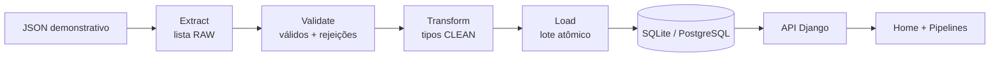

# Pipeline de dados — pedidos

## Objetivo e fonte

A primeira pipeline real do OpsMind sincroniza pedidos de uma exportação demonstrativa
de ERP com os models operacionais já consumidos por analytics, alertas e IA. A fonte
versionada é [`backend/data/source/orders.json`](../backend/data/source/orders.json).
JSON foi escolhido porque um pedido contém uma lista de itens; em CSV seria necessário
repetir o cabeçalho ou codificar uma estrutura aninhada em texto.

O arquivo tem 16 registros: 12 válidos e quatro inválidos deliberados. Ele comprova
duplicidade de ID na fonte, filial inexistente, preço negativo e entrega anterior ao
pedido. Os nomes e valores são sintéticos. O seed continua sendo responsável pelos
catálogos de filiais, clientes e produtos usados para resolver as referências.



## Extract, Validate, Transform e Load

`operations/ingestion/` mantém as quatro fronteiras explícitas:

- `extract.py` abre UTF-8, interpreta JSON e garante somente a estrutura RAW: lista
  de objetos. Erro de arquivo, encoding ou JSON encerra a execução como `failed`.
- `validate.py` não grava. Carrega catálogos uma vez, percorre os registros e separa
  os válidos das rejeições. Um registro inválido não bloqueia os demais.
- `transform.py` converte datas ISO com fuso, `Decimal`, quantidades e referências
  já validadas em dataclasses imutáveis (`CleanOrder` e `CleanOrderItem`).
- `load.py` sincroniza cabeçalho e itens. Toda a publicação BUSINESS fica em um
  `transaction.atomic()`; falha em qualquer item desfaz o lote da execução.

O orquestrador `runner.py` cria `PipelineRun`, atualiza o estado real de cada etapa,
persiste rejeições e finaliza contagens, duração e publicação. A leitura e a validação
ficam fora da transação de carga para evitar transação longa.

## Modelos e status

`Order` ganhou `source_system` e `external_id`. Pedidos antigos/seed mantêm
`external_id=null`; a restrição condicional torna a dupla origem + ID única quando
há um identificador externo.

`PipelineRun` registra pipeline, fonte, status, quatro etapas em JSON, início, fim,
publicação, duração, contagens e uma mensagem operacional de falha. Os status são:

- `running`: criada e ainda em processamento;
- `success`: publicada sem rejeições;
- `warning`: publicada, com um ou mais registros rejeitados;
- `failed`: não chegou a uma publicação completa.

As etapas não têm model próprio. O JSON pequeno é suficiente para informar
`pending`, `running`, `success`, `warning` ou `failed`, inclusive qual etapa falhou.
`PipelineIssue` guarda apenas FK da execução, identificador do registro, código,
mensagem e instante da detecção. O detalhe da API não expõe traceback nem caminhos.

## Validações

Para cada pedido, a pipeline verifica:

- `external_id` obrigatório e não repetido dentro do arquivo;
- filial existente por nome e cliente resolvido de forma única por nome;
- status contido em `Order.Status`;
- datas ISO 8601 com fuso; promessa posterior à criação; entrega não anterior à
  criação; pedido entregue com `delivered_at`;
- lista não vazia de itens, SKU existente e não repetido no mesmo pedido;
- quantidade inteira positiva e preço unitário finito e não negativo;
- total declarado finito, não negativo e igual à soma `quantidade × preço` dos itens.

Atraso continua sendo definido pelo campo `status`, conforme o contrato analítico
existente. A pipeline não reclassifica status por conta própria.

## Idempotência, qualidade e freshness

`source_system="demo_erp"` + `external_id` identifica um pedido. O loader usa
`update_or_create`, atualiza o cabeçalho e substitui os itens na mesma transação.
Reexecutar o mesmo arquivo cria uma nova execução de monitoramento, mas mantém 12
pedidos externos em vez de duplicá-los.

Qualidade é calculada por execução:

```text
registros válidos ÷ registros recebidos × 100
```

Zero recebidos resulta em qualidade sem base (`null`), não em 100%. `published_at`
é gravado depois que o lote atômico termina. `last_published_at` considera a execução
mais recente com publicação, mesmo se uma tentativa posterior falhar. A interface
calcula “há N minutos” a partir desse timestamp real; `started_at`, `created_at` do
pedido e a data analítica não são usados como freshness.

## Como executar

Primeiro prepare catálogos e schema. No PowerShell, a partir da raiz:

```powershell
.\.venv\Scripts\Activate.ps1
cd backend
python manage.py migrate
python manage.py seed_demo
python manage.py run_data_pipeline orders
```

Para outra exportação com o mesmo contrato:

```powershell
python manage.py run_data_pipeline orders --source C:\dados\orders.json
```

O comando imprime recebidos, válidos, rejeitados, transformados, carregados, status,
qualidade, duração e ID da execução. Uma falha real termina com `CommandError` e
exit code diferente de zero. Não execute `seed_demo --reset` em dados que precisam
ser preservados: na demonstração, o reset também limpa o histórico da pipeline para
não manter freshness referente a pedidos removidos.

## API e frontend

- `GET /api/data/pipelines/`: catálogo e último estado de cada pipeline.
- `GET /api/data/pipelines/orders/`: estado atual, última publicação e dez execuções.
- `GET /api/data/pipelines/orders/runs/{id}/`: execução e rejeições.

A Home carrega o detalhe de pedidos junto das outras seções e apresenta estado,
etapas, publicação, qualidade e contagens. A sidebar consulta o catálogo. `/pipelines`
mostra o retrato atual, histórico e detalhe das rejeições. Nenhum `GET` executa carga.

## Como testar

```powershell
cd backend
..\.venv\Scripts\python.exe -m pytest
..\.venv\Scripts\python.exe manage.py check --settings=config.test_settings
..\.venv\Scripts\python.exe manage.py makemigrations --check --dry-run --settings=config.test_settings

cd ..\frontend
npm test
npm run lint
npm run build
```

`test_pipeline.py` cobre sucesso, warning, rejeição, falha, qualidade, idempotência,
atomicidade, fonte versionada, comando e três estados da API. O banco de testes é
SQLite descartável e o provider de IA é mock.

## Limitações atuais

Há uma pipeline e uma fonte demonstrativa local; não existem upload, scheduler,
autenticação, retenção configurável, paginação do histórico ou múltiplas origens.
Filiais e clientes são resolvidos por nome porque ainda não possuem ID externo;
renomear ou duplicar clientes exige evoluir esse contrato. O JSON RAW não é copiado
para o banco; a fonte versionada é a evidência bruta da demo.

O runner síncrono pressupõe uma execução administrativa por vez. A unicidade protege
duplicação de pedidos, mas não há lock distribuído. O caminho foi preparado para
SQLite/PostgreSQL pelo ORM, porém o teste manual desta fase usou SQLite; Supabase e
Vercel não foram usados. GitHub Actions poderia executar migrations e o management
command contra uma conexão administrativa protegida por environment/secret, com
concorrência limitada a uma execução, mas essa automação não foi criada nesta fase.
